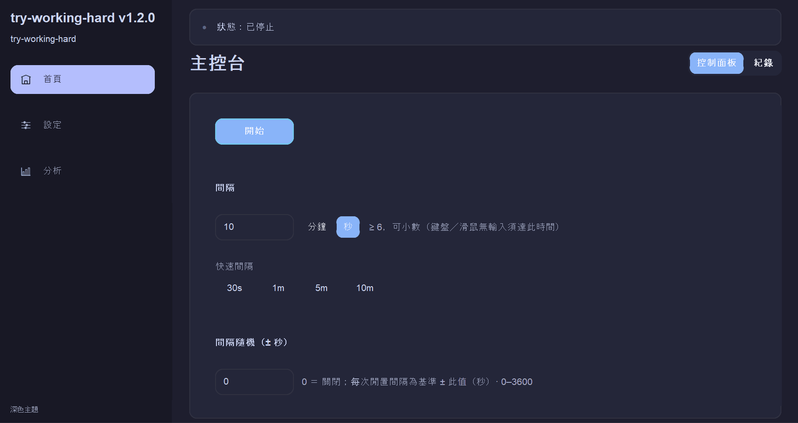

# try-working-hard



**Languages:** English (this file) · [正體中文](README.zh-TW.md)  
Windows desktop utility that nudges the cursor only after real idle time.  
Modes: `Pattern` (line/circle/square) or `Natural` (irregular micro-moves).  
Cursor returns to original position after each cycle.  
Use only in lawful, compliant personal scenarios.

**30-second start**
1. `uv sync`
2. `uv run try-working-hard`
3. Set Interval + mode
4. Click **Start** on Home and watch countdown

**Need more detail?** See [Usage](#usage) and [FAQ (quick)](#faq-quick) below.

## Contents

- [Requirements](#requirements)
- [Install and run](#install-and-run)
- [Usage](#usage)
- [FAQ (quick)](#faq-quick)
- [Technical notes](#technical-notes)
- [Limitations](#limitations)
- [Disclaimer](#disclaimer)
- [License](#license)

## Requirements

- **Windows** (cursor movement uses the Win32 API)
- **Python** 3.10 or newer
- **[uv](https://docs.astral.sh/uv/)** is recommended to manage the environment and run the app

## Install and run

From the project root:

```powershell
uv sync
uv run try-working-hard
```

Or as a module:

```powershell
uv run python -m mouse_jiggler
```

### Windows executable (no Python)

Tagged releases on **GitHub** attach a **single-file** build named with the tag version: `try-working-hard-vX.Y.Z.exe` (for example `try-working-hard-v1.2.0.exe`, PyInstaller one-file, no console). Download the asset for your target release and run it directly.

- How the `.exe` is built locally or in CI: [docs/WINDOWS-BUILD.md](docs/WINDOWS-BUILD.md) (also covers SmartScreen, alternatives such as Briefcase at a high level).
- **Tag a release:** push a `v*` tag (for example `v1.0.0`); [`.github/workflows/release.yml`](.github/workflows/release.yml) runs tests, builds the executable, and uploads it to that release.

### Keyboard and accessibility

- **F1** opens a help dialog with shortcuts. **F2 / F3 / F4** switch main areas; on **Home → Control**, **F5** starts and **Shift+F5** stops when available; **Enter** / **Esc** do the same while the **main window is visible** (they do nothing when the app is only in the **system tray**). **F6** toggles Control / Log. You can **click the interval, interval jitter, nudge, path speed, activity, and path labels** to focus the matching field; **30s / 1m / 5m / 10m** under the interval field apply a quick preset. **Tab / Shift+Tab** moves between controls.
- CustomTkinter draws many controls on a **canvas**, so **screen reader** coverage is not the same as for fully native Win32 UIs. Details: [docs/ACCESSIBILITY.md](docs/ACCESSIBILITY.md).

## Usage

### Quick start (recommended)

1. Launch the app and pick language in the startup prompt.
2. Set **Interval** (use `30s / 1m / 5m / 10m` presets if you want).
3. Choose **Activity** (`Pattern` or `Natural`) and set nudge size.
4. Click **Start** on Home -> Control.
5. Watch the top status strip for the next-nudge countdown.

### Most used settings

- **Interval:** minimum idle time before a nudge.
- **Interval jitter:** randomizes spacing (`interval ± N sec`).
- **Nudge size / Path speed:** controls distance and movement speed.
- **Schedule window:** optional active hours (`HH:MM` start/end) plus advanced segments/cron in `config.json`.
- **Tray behavior:** default close = stop and exit; optional close-to-tray keeps running.

### Keyboard and workflow shortcuts

- **F1** help, **F2/F3/F4** switch main areas, **F6** toggle Control/Log.
- On Home -> Control: **F5** start, **Shift+F5** stop.
- **Enter / Esc** map to start/stop only while the main window is visible.

### Detailed reference

- Startup prompt includes optional quick guide and stores suppression in `config.json` (`intro_acknowledged`).
- Settings page supports theme (`ui_theme`), language, update checks (`auto_check_updates`), schedule summary, and opening `config.json`.
- Analytics page shows Matplotlib charts and persists usage stats to `analytics.json` next to `config.json`.
- Start-in-tray is available via `uv run python -m mouse_jiggler --start-in-tray` (and for frozen `.exe` with the same flag).

## FAQ (quick)

- **Does it move continuously?** No, it waits for your configured idle interval.
- **Does cursor position drift?** No, it restores to the original point each cycle.
- **Can I run without Python?** Yes, use the release `.exe` asset.
- **Can it start in tray?** Yes, launch with `--start-in-tray`.
- **Can it be used to bypass policy controls?** No.

## Technical notes

- GUI: **CustomTkinter** — **light** mode now uses a cleaner SaaS palette (`#F5F7FB` background, `#FFFFFF` sidebar/cards, `#E2E8F0` borders) with blue accent states (`#3B82F6` / `#2563EB` / `#1D4ED8`). **Dark** mode now uses a modern dark palette (`#1E1E2E` background, `#181825` sidebar, `#24273A` cards, `#313244` borders) with cool-blue accent states (`#89B4FA` / `#74C7EC` / `#B4BEFE`). **Home** uses a segmented control for Control / Log.
- **Analytics**: **Matplotlib** figures embedded via **TkAgg**; persisted aggregates in **`analytics.json`** next to **`config.json`**.
- Mouse: **ctypes** calling `user32.GetCursorPos` / `SetCursorPos`; **Natural** mode may also call `mouse_event` for rare left clicks and wheel deltas. Schedule uses `user32.GetLastInputInfo` with `kernel32.GetTickCount` for idle time
- Tray: **pystray**; icon: **Pillow** (shared PNG for window, tray, and—when rebuilt—[`packaging/app.ico`](packaging/app.ico) for the `.exe`; see [docs/WINDOWS-BUILD.md](docs/WINDOWS-BUILD.md))

## Limitations

- Behavior may differ when the screen is locked or in some remote-desktop setups.
- Do not use this tool to bypass security, monitoring, or compliance controls you are required to follow.

## Disclaimer

This software is provided **“as is”**, **without warranty of any kind**, whether express or implied (including but not limited to merchantability, fitness for a particular purpose, or non‑infringement). You **choose to use** it **at your own risk**.

In no event shall the authors or contributors be liable for **any direct, indirect, incidental, special, consequential, or punitive damages** arising out of or related to use or inability to use this software (including but not limited to loss of data, business interruption, hardware damage, or consequences of violating employer rules or laws)—**even if advised of the possibility** of such damages.

You agree to use this software only in a manner that **complies with applicable laws** and with employer, school, contractual, and service obligations. You **must not** use it to circumvent security controls, labor or attendance monitoring, audits, license checks, or for any unlawful or improper purpose. **You bear sole responsibility** for any legal or financial liability arising from your use.

## License

This project is licensed under the **MIT License**. See the [`LICENSE`](LICENSE) file in the repository root for the full text.

In short: you may use, modify, distribute, and sublicense the software subject to retaining the copyright and permission notice; the software is still provided **as-is, without warranty**, consistent with the disclaimer above and the full `LICENSE`.
